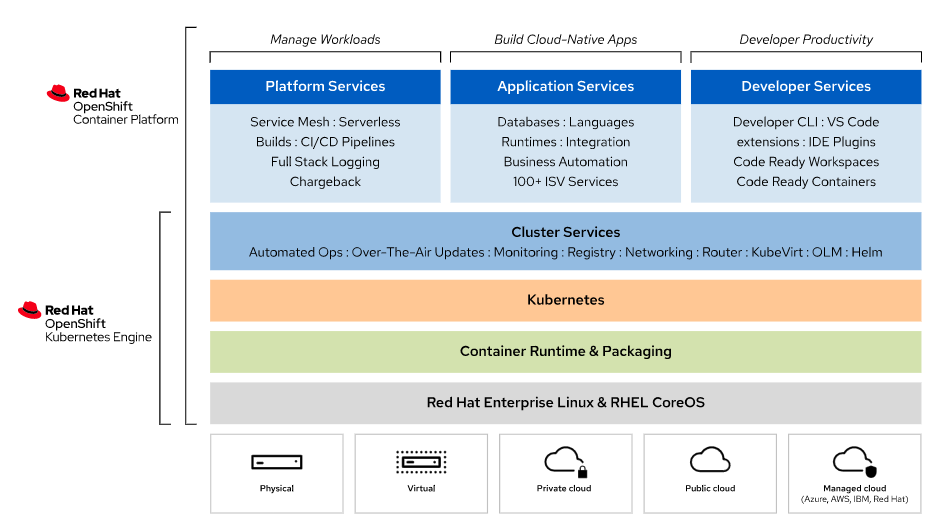
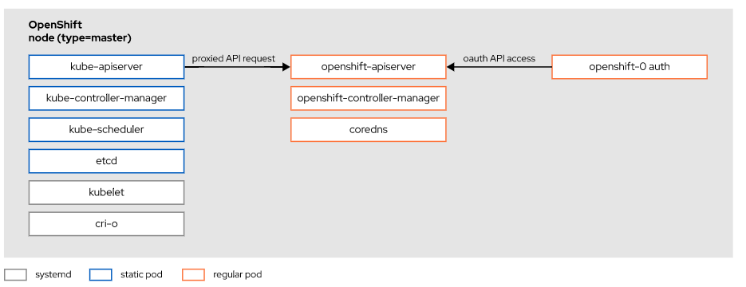
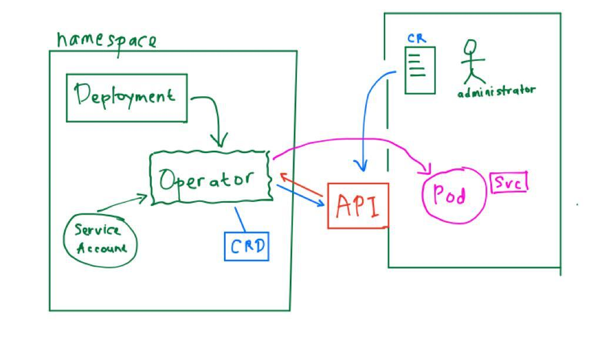
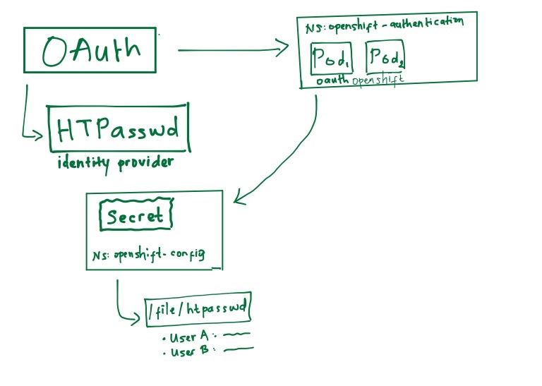

# Red Hat OpenShift Container Platform
## OpenShift Container Platform Features  


## Openshift Features


## Openshift Control Plane 
  
##### this document using Openshift ver.4.5

## Openshift Cluster Operators  
- Kubernetes Operators  
    - Operators usually define custom resources (CR) that store their settings and configurations.  
    - The syntax of a custom resource is defined by a custom resource definition (CRD).  
    - An OpenShift administrator manages an operator by editing its custom resources.  

- Openshift Cluster Operators manages some following list of cluster operator: 
    - network  
    - ingress  
    - storage  
    - authentication  
    - console  
    - monitoring  
    - image-registry  
    - cluster-autoscaler  
    - openshift-apiserver  
    - dns  
    - openshift-controller-manager  
    - cloud-credential  
  

- Operator  
    - An application that manages Kubernetes resources.  
- Operator SDK  
    - An open source toolkit for building, testing, and packaging operators.  
- Operator Catalog  
    - A repository for discovering and installing operators.  
- Custom Resource Definition (CRD)  
    - An extension of the Kubernetes API that defines the syntax of a custom resource.  
- Operator Lifecycle Manager (OLM)  
    - An application that manages Kubernetes operators.  
- OperatorHub  
    - A public web service where you can publish operators that are compatible with the OLM.  
- Operator Image  
    - The artifact defined by the Operator Framework that you can publish for consumption by an OLM instance.  


## Troubleshooting OpenShift Clusters and Applications  
### Verifying the Health of OpenShift Nodes  
- `oc get nodes`  
```bash
NAME       STATUS   ROLES           AGE   VERSION
master01   Ready    master,worker   2d    v1.18.3+012b3ec
master02   Ready    master,worker   2d    v1.18.3+012b3ec
master03   Ready    master,worker   2d    v1.18.3+012b3ec
```

- `oc adm top nodes`  
Displays the current CPU and memory usage of each node.  
These are actual usage numbers, not the resource requests that the OpenShift scheduler considers as the available and used capacity of the node.  
```bash
NAME       CPU(cores)   CPU%   MEMORY(bytes)   MEMORY%
master01   499m         14%    3235Mi          21%
master02   769m         21%    4933Mi          33%
master03   1016m        29%    6087Mi          40%
```

- `oc describe node my-node-name`  
To retrieve the cluster version  
```bash
NAME      VERSION   AVAILABLE   PROGRESSING   SINCE   STATUS
version   4.5.4     True        False         4d23h   Cluster version is 4.5.4
```

- `oc get clusteroperators`  
```bash
NAME                      VERSION   AVAILABLE   PROGRESSING   DEGRADED   SINCE
authentication            4.5.4     True        False         False      3h58m
cloud-credential          4.5.4     True        False         False      4d23h
cluster-autoscaler        4.5.4     True        False         False      4d23h
config-operator           4.5.4     True        False         False      4d23h
console                   4.5.4     True        False         False      3h58m
csi-snapshot-controller   4.5.4     True        False         False      4d23h
dns                       4.5.4     True        False         False      4d23h
etcd                      4.5.4     True        False         False      4d23h
image-registry            4.5.4     True        False         False      4d23h
...output omitted...
```  

#### Openshift Nodes  
##### Show logs of Openshift Nodes  
- `oc adm node-logs -u crio my-node-name`  
    - display the crio service logs on my-node-name OCP node  
- `oc adm node-logs -u kubelet my-node-name`  
    - display the kubelet service logs on my-node-name OCP node  
- `oc adm node-logs my-node-name`  
    - display all journal logs of node  

##### Open a shell prompt on an Openshift Node  
- `oc debug node/my-node-name`  
```bash
Starting pod/master01-debug ...
To use host binaries, run `chroot /host`
Pod IP: 192.168.50.10
If you don't see a command prompt, try pressing enter.

sh-4.2# chroot /host
sh-4.2# 
sh-4.2# systemctl status kubelet
● kubelet.service - MCO environment configuration
   Loaded: loaded (/etc/systemd/system/kubelet.service; enabled; vendor preset: enabled)
  Drop-In: /etc/systemd/system/kubelet.service.d
           └─10-mco-default-env.conf
   Active: active (running) since Fri 2020-07-31 16:26:57 UTC; 4h 32min ago
...output omitted...
sh-4.2# 
sh-4.2# systemctl status cri-o
● crio.service - MCO environment configuration
   Loaded: loaded (/usr/lib/systemd/system/crio.service; disabled; vendor preset: disabled)
  Drop-In: /etc/systemd/system/crio.service.d
           └─10-mco-default-env.conf
   Active: active (running) since Fri 2020-07-31 16:26:50 UTC; 4h 35min ago
...output omitted...

```

#### Troubleshooting Application Deployments  
`oc get pod`  
`oc status`  
`oc describe pod my-pod-name`  
`oc logs my-pod-name`  
`oc logs my-pod-name -c container-name`  
`oc logs my-pod-name --all-containers`  

##### Creating troubleshooting pod using `oc debug`  
`oc debug deployment/my-deployment-name --as-root`  

##### rsh command  
`oc rsh my-pod-name`  
    Opens a shell inside a pod to run shell commands interactively and non-interactively.  

##### Copy files  
`oc cp /local/path my-pod-name:/container/path`  

##### Verbose log level  
`oc get pod --loglevel 6`  
`oc get pod --loglevel 10`  

##### Get current token  
`oc whoami -t`  


##### Port-forward  
`oc port-forward my-pod-name local-port:remote-port`  
    Creates a TCP tunnel from local-port on your workstation to local-port on the pod. The tunnel is alive as long as you keep the oc port-forward running. This allows you to get network access to the pod without exposing it through a route. Because the tunnel starts at your localhost, it cannot be accessed by other machines.

##### skopeo inspect  
`skopeo inspect docker://registry.access.redhat.com/rhscl/postgresq-96-rhel7:1`
```bash
FATA[0000] Error parsing image name "docker://registry.access.redhat.com/rhscl/postgresq-96-rhel7:1": Error reading manifest 1 in registry.access.redhat.com/rhscl/postgresq-96-rhel7: name unknown: Repo not found
```

`skopeo inspect docker://registry.access.redhat.com/rhscl/postgresql-96-rhel7:1`  
This command checks whether the remote registry access is exist or not.


## OpenShift Dynamic Storage  
### Persistent Storage  
Two ways of provisioning storage for the cluster:  
- Static  
    - Static provisioning requires the cluster administrator to create persistent volumes manually.  
- Dynamic  
    - Dynamic provisioning uses storage classes to create the persistent volumes on demand.  
    - Verifying dynamic storageclass:  
    ```bash
    oc get storageclass
        NAME                    PROVISIONER               ...
        nfs-storage (default)   nfs-storage-provisioner   ...
    ```  

#### PVC and PV  
- PVC: persistent volume claim  
    - Specify a name for the persistent volume claim.This name is use in the `claimName` field in the volume section of Deployment manifest.  
    - Important to specify `Access Modes`. If PV persistent volumes are created statically, then an eligible persistent volume must provide this access mode.  
        - ReadWriteMany(RWX): Kubernetes can mount the volume as read-write on many nodes.  
        - ReadOnlyMany(ROX): Kubernetes can mount the volume as read-only on many nodes.  
        - ReadWriteOnce(RWO): Kubernetes can mount the volume as read-write on only a single node.  
    - Important to specify `Size Request`.  If persistent volumes are created statically, then an eligible persistent volume must be at least the requested size.  

```yaml
apiVersion: v1
kind: PersistentVolumeClaim
metadata:
  name: example-pv-claim
  labels:
    app: example-application
spec:
  accessModes:
    - ReadWriteOnce
  resources:
    requests:
      storage: 15Gi
```  

##### Add PVC on the application  
```yaml
...
spec:
   volumes:
     - name: example-pv-storage
       persistentVolumeClaim:
         claimName: example-pv-claim
   containers:
   - name: example-application
     image: registry.redhat.io/rhel8/example-app
     ports:
     - containerPort: 1234
     volumeMounts:
       - mountPath: "/var/lib/example-app"
         name: example-pv-storage
```

## # Authentication and Authorization
#### # OpenShift Users and Groups  
`User`  
In the OpenShift Container Platform architecture, users are entities that interact with the API server. The user resource represents an actor within the system. Assign permissions by adding roles to the user directly or to the groups of which the user is a member.  

`Group`  
Groups represent a specific set of users. Users are assigned to one or to multiple groups. Groups are leveraged when implementing authorization policies to assign permissions to multiple users at the same time.  

`Identity`  
The identity resource keeps a record of successful authentication attempts from a specific user and identity provider. Any data concerning the source of the authentication is stored on the identity. Only a single user resource is associated with an identity resource.  

`Service Account`  
In OpenShift, applications can communicate with the API independently when user credentials cannot be acquired. To preserve the integrity of a regular user's credentials, credentials are not shared and service accounts are used instead. Service accounts enable you to control API access without the need to borrow a regular user's credentials.  

`Role`  
A role defines a set of permissions that enables a user to perform API operations over one or more resource types. You grant permissions to users, groups, and service accounts by assigning roles to them.  

#### # Authenticating API Requests  
##### 1. OAuth Access Tokens  
##### 2. X.509 Client Certificates  
The installation logs provide the location of the kubeconfig file:  
`INFO Run 'export KUBECONFIG=root/auth/kubeconfig' to manage the cluster with 'oc'.`  
This kubeconfig file can be used to authenticate to the OCP cluster.  

#### # Authenticating API Requests  
To improve OpenShift cluster security, you can remove the kubeadmin user credentials after you define an identity provider, create a new user, and assign that user the cluster-admin role.  
```bash
$ oc delete secret kubeadmin -n kube-system

```

```yaml
apiVersion: config.openshift.io/v1
kind: OAuth
metadata:
  name: cluster
spec:
  indentityProviders:
  - name: my_httpasswd_provider
    mappingMethod: claim
    type: HTPasswd
    htpasswd:
      fileData:
        name: htpasswd-secret
```  

## # Defining and Applying Permissions Using RBAC (Role-based Access Control)  
#### # RBAC Object  
- `Rule`  
  - Allowed actions for objects or groups of objects.  
- `Role`
  - Sets of rules. Users and groups can be associated with multiple roles.  
- `Binding`
  - Assignment of users or groups to a role.  

#### # RBAC Scope  
- Cluster Role  
  - Users or groups with this role level can manage the OpenShift cluster.  
- Local Role  
  - Users or groups with this role level can only manage elements at a project level.  

#### # Managing RBAC using CLI  
Add/remove a cluster-role to a user:  
`oc adm policy add-cluster-role-to-user CLUSTER-ROLE USER-NAME`  
`oc adm policy remove-cluster-role-to-user CLUSTER-ROLE USER-NAME`  

Add/remove a role to a user:  
`oc policy add-role-to-user ROLE USER-NAME -n PROJECT`  
`oc policy remove-role-to-user ROLE USER-NAME -n PROJECT`  

#### # Default Roles  
- `cluster-admin`  
  - Users with this role have superuser access to the cluster resources. These users can perform any action on the cluster, and have full control of all projects.  
- `cluster-status`  
  - Users with this role can get cluster status information.  
- `self-provisioner`  
  - Users with this role can create new projects. This is a cluster role, not a project role.  
- `admin`  
  - Users with this role can manage all project resources, including granting access to other users to access the project.  
- `basic-user`  
  - Users with this role have read access to the project.  
- `edit`  
  - Users with this role can create, change, and delete common application resources from the project, such as services and deployment configurations. These users cannot act on management resources such as limit ranges and quotas, and cannot manage access permissions to the project.  
- `view`  
  - Users with this role can view project resources, but cannot modify project resources.  

## # QUIZ: Configuring Identity Providers
#### # Follow below instructions:  
1. Create htpasswd file and add `user1` with the password `pass1`. Set the htpasswd file as /tmp/htpasswd.  
2. Add `user2` with the password `pass2`.  
3. Create secret that contains the HTPasswd users file mentioned above. Secret's name is `localusers`.  
4. Update the HTPasswd identity provider for the cluster so that you can authenticate above users mentioned in the htpasswd file.  
5. Assign `user1` as `cluster-admin` role.  
6. Extract the current `localusers` secret to htpasswd file at /tmp directory. Add `manager` user with password `manager`. Change the password for `user2` to `pass222`. Update the secret and make sure you can login with `manager` and `user2`.  
7. Remove the `user2` (user and identity).  
8. VERY CAREFUL ON THIS, IF YOU DELETE kubeadmin, YOU WILL NEVER BE ABLE TO LOGIN WITH kubeadmin. After creating all the users, delete the Virtual user `kubeadmin` to enhance security.  

  


#### # Answer
<details>
<summary>Answer</summary>  

1. Create htpasswd file and add `user1` with the password `pass1`. Set the htpasswd file as /tmp/htpasswd.  
```bash
htpasswd -c -B -b /tmp/htpasswd user1 pass1
```  

2. Add `user2` with the password `pass2`.  
```bash
htpasswd -b /tmp/htpasswd user2 pass2
```  

3. Create secret that contains the HTPasswd users file mentioned above. Secret's name is `localusers`.  
```bash
#Login with admin user
oc login -u kubeadmin -p $KUBEADM_PASSWD $OCP_CLUSTER

oc create secret generic localusers --from-file htpasswd=/tmp/htpasswd -n openshift-config

#Check whether the secret created successfully
oc get secret localusers -n openshift-config
oc extract secret/localusers -n openshift-config --to -
```  

4. Update the HTPasswd identity provider for the cluster so that you can authenticate above users mentioned in the htpasswd file. Configure the HTPasswd identity name as `myuser`.  
```bash
#Check the current OAuth setting
oc get oauth
    NAME    AGE
    cluster 234d

#Check the current OAuth Pod
oc get pod -n openshift-authentication

# Edit the current OAuth setting on your OpenShift cluster
oc edit oauth cluster
```  
Edit the oauth cluster with the below entries:  
```yaml
apiVersion: config.openshift.io/v1
kind: OAuth
...
spec:
  identityProviders:
  - htpasswd:
      fileData:
        name: localusers    #put the secret name here
    mappingMethod: claim    #set the mappingmethod
    name: myusers           #set the identity name
    type: HTPasswd          #set the identity provider
```  

Check the pod at openshift-authentication project:  
```bash
#The new OAuth Pod should be re-created after the above configuration. 
oc get pod -n openshift-authentication
```  

5. Assign `user1` as `cluster-admin` role.  
```bash
oc whoami

oc adm policy add-cluster-role-to-user cluster-admin user1

oc login -u user1 -p pass1

oc get nodes
```

6. Extract the current `localusers` secret to htpasswd file at /tmp directory. Add `manager` user with password `manager`. Change the password for `user2` to `pass222`. Update the secret and make sure you can login with `manager` and `user2`.  
```bash
oc extract secret/localusers -n openshift-config --to /tmp/ --confirm

htpasswd -b /tmp/htpasswd-mgr manager manager
htpasswd -b /tmp/htpasswd-mgr user2 pass222

oc set data secret/localusers --from-file htpasswd=/tmp/htpasswd-mgr -n openshift-config

oc get pod -n openshift-authentication

oc login -u manager -p manager
oc login -u user2 -p pass222
```  

7. Remove the `user2` (user and identity).  
```bash
oc login -u user1 -p pass1

oc extract secret/localusers -n openshift-config --to /tmp/ --confirm

cat /tmp/htpasswd
htpasswd -D /tmp/htpasswd user2
cat /tmp/htpasswd

oc get user,identity

oc set data secret/localusers --from-file htpasswd=/tmp/htpasswd -n openshift-config

oc get pod -n openshift-authentication

oc get user,identity

oc delete user user2

oc delete identity myusers:user2
```  

8. VERY CAREFUL ON THIS, IF YOU DELETE kubeadmin, YOU WILL NEVER BE ABLE TO LOGIN WITH kubeadmin. After creating all the users, delete the Virtual user `kubeadmin` to enhance security.  
```bash
#Login as cluster-admin with user1
oc login -u user1 -p pass1

oc get secret kubeadmin -n kube-system

oc delete secret kubeadmin -n kube-system
oc get secret kubeadmin -n kube-system
```  
</details>  


## # QUIZ: Authentication and Authorization
#### # This quiz is testing your understanding about HTPasswd identity provider and RBAC :  
1. Create htpasswd file with users `tester`, `leader`, `admin`, `developer` with the password `L@bR3v!ew`. Set the htpasswd file as /tmp/htpasswd.  
2. Configure your cluster to use the HTPasswd identity provider using the configured /tmp/htpasswd.  
3. Make the `admin` user a cluster administrator. Log in as both `admin` and as `developer` to verify HTPasswd user configuration and cluster privileges.  
4. As the `admin` user, remove the ability to create projects cluster wide.  
5. Create a group named `managers`, and add the `leader` user to the group. Grant project creation privileges to the `managers` group. As the `leader` user, create the `auth-review` project.  
6. Create a group named `developers` and grant `edit` privileges on the `auth-review` project. Add the `developer` user to the group.  
7. Create a group named `qa` and grant `view` privileges on the `auth-review` project. Add the `tester` user to the group.  

#### # Answer
<details>
<summary>Answer</summary>  

1. Create htpasswd file with users `tester`, `leader`, `admin`, `developer` with the password `L@bR3v!ew`. Set the htpasswd file as /tmp/htpasswd.  
```bash
htpasswd -c -B -b /tmp/htpasswd tester 'L@bR3v!ew'
htpasswd -c -B -b /tmp/htpasswd leader 'L@bR3v!ew'
htpasswd -c -B -b /tmp/htpasswd admin 'L@bR3v!ew'
htpasswd -c -B -b /tmp/htpasswd developer 'L@bR3v!ew'
```  

2. Configure your cluster to use the HTPasswd identity provider using the configured /tmp/htpasswd.  
```bash
oc login -u kubeadmin -p $RHT_OCP4_KUBEADM_PASSWD $RHT_OCP4_HTTPS

oc create secret generic auth-review --from-file htpasswd=/tmp/htpasswd -n openshift-config

oc get oauth cluster

oc edit oauth cluster
```  
Edit the oauth cluster and add the below HTPasswd configuration:  
```yaml
...
spec:
  identityProviders:
    - name: htpasswd-provider
      httpasswd:
        fileData:
          name: auth-review # secret name
      mappingMethod: claim
      type: HTPasswd
```  

```bash
#Check the OAuth pod which is redeployed after the HTPasswd configuration
oc get pod -n openshift-authentication
```  

3. Make the `admin` user a cluster administrator. Log in as both `admin` and as `developer` to verify HTPasswd user configuration and cluster privileges.  
```bash
oc get user,identity

oc adm policy add-cluster-role-to-user cluster-admin admin

oc login -u admin -p 'L@bR3v!ew'
oc whoami; oc get nodes

oc login -u developer -p 'L@bR3v!ew'
oc whoami; oc get nodes
# oc get nodes will be failed (not authorized)
```

4. As the `admin` user, remove the ability to create projects cluster wide.  
```bash
oc login -u admin -p 'L@bR3v!ew'

oc get clusterrolebinding | egrep "NAME|self-provisioner"

oc adm policy remove-cluster-role-from-group self-provisioner system:authenticated:oauth

```  

5. Create a group named `managers`, and add the `leader` user to the group. Grant project creation privileges to the `managers` group. As the `leader` user, create the `auth-review` project.  
```bash
oc adm groups new managers

oc adm groups add-users managers leader

oc adm policy add-cluster-role-to-group self-provisioner managers

oc login -u leader -p 'L@bR3v!ew'

oc new-project auth-review
```

6. Create a group named `developers` and grant `edit` privileges on the `auth-review` project. Add the `developer` user to the group.  
```bash
oc login -u admin -p 'L@bR3v!ew'

oc adm groups new developers

oc adm groups add-users developers developer

oc policy add-role-to-group edit developers -n auth-review
```

7. Create a group named `qa` and grant `view` privileges on the `auth-review` project. Add the `tester` user to the group.  
```bash
oc adm groups new qa

oc adm groups add-users qa tester

oc policy add-role-to-group view qa
```
</details>


## # Configuring Application Security  
#### # Managing sensitive information with secrets  

##### #Features of Secret:  
- Secret data can be shared within a project namespace.  
- Secret data is referenced independently of secret definition. Administrators can create and manage a secret resource that other team members can reference in their deployment configurations.  
- Secret data is injected into pods when OpenShift creates a pod. You can expose a secret as an environment variable or as a mounted file in the pod.  
- If the value of a secret changes during pod execution, the secret data in the pod does not update. After a secret value changes, you must create new pods to inject the new secret data.  
- Any secret data that OpenShift injects into a pod is ephemeral. If OpenShift exposes sensitive data to a pod as environment variables, then those variables are destroyed when the pod is destroyed.  

##### #Use Cases of Secret:  
1. Credentials  
  - Store sensitive information, such as passwords and username for application.  
2. TLS (Transport Layer Security) and Key Pairs  
  - Use a TLS certificate (tls.crt) and key (tls.key) to secure communication to a pod.  

```bash
oc create secret generic SECRETNAME --from-literal key1=val1
oc create secret generic SECRETNAME --from-file SECRETFILE=/path-to-secret-file
oc create secret tls SECRETNAME --cert /path-to-certificate --key /path-to-key

```  

##### #Configure secrets inside Pod:  

- Configure secret inside Pod:  
```yaml
...
env:
  - name: MYSQL_ROOT_PASSWORD       #environment variable in the Pod
    valueFrom:              
      secretKeyRef:
        name: demo-secret           #name of secret
        key: root_password          #name of key inside the secret
```

- Inject secret to Pod deployment  
```bash
oc set env deployment/demo --from secret/demo-secret --prefix MYSQL_
```  

- Secrets as Files in a Pod  
```bash
oc set volume deployment/demo --add --type=secret --secret-name=demo-secret --mount-path=/app-secrets
```  

#### # Configuration Map  
- Similar to secrets, configuration maps decouple configuration information from container images. Unlike secrets, the information contained in configuration maps does not require protection.  

```bash
oc create configmap CONFIGMAPNAME --from-literal key1=val1
oc create configmap CONFIGMAPNAME --from-file CMFILE=/path-to-configmapfile
```  

#### # Updating Secrets and Configmap  
```bash
oc extract secret/SECRETNAME -n NAMESPACE --to /path-to-directory/ --confirm

oc set data secret/SECRETNAME --from-file /path-to-directory/secretfile -n NAMESPACE
```  


## # QUIZ: Debug error Pod and configure secrets  
#### # Managing sensitive information with secret  
1. Create `test-pj` project with admin user.  
2. Configure `mysql` secret in `test-pj` with the below entries:  
  - user = myuser  
  - password = redhat123  
  - database = test_secrets  
  - hostname = mysql  
3. Create Database app with the following details:  
  - deployment name = mysql  
  - docker image = registry.access.redhat.com/rhscl/mysql-57-rhel7:5.7-47  
  - Analyze the logs and fix the error  


#### # Answer
<details>  
<summary>Answer</summary>  

1. Create `test-pj` project with admin user.  
```bash
oc login -u kubeadmin -p $KUBEADM_PASSWD

oc new-project test-pj
```  

2. Configure `mysql` secret in `test-pj` with the below entries:  
  - user = myuser  
  - password = redhat123  
  - database = test_secrets  
  - hostname = mysql  
```bash
oc create secret generic mysql --from-literal user=myuser --from-literal password=redhat123 --from-literal database=test_secrets --from-literal hostname=mysql

oc get secret mysql

oc describe secret mysql
```  

3. Create Database app with the following details:  
  - deployment name = mysql  
  - use image from registry.access.redhat.com/rhscl/mysql-57-rhel7:5.7-47  
  - Analyze the logs and fix the error  
```bash
oc new-app --name mysql --docker-image registry.access.redhat.com/rhscl/mysql-57-rhel7:5.7-47 

oc get pod 

#Find the details of pod's error info
oc logs PODNAME

oc get deployment

#Modify pod's deployment to use the secret mysql
oc set env deployment/mysql --from secret/mysql --prefix MYSQL_

#Make sure your pod run normal
oc get pod
oc logs PODNAME

#If needed, you can also mount the secret as file to a pod
oc set volume deployment/mysql --add --type secret --mount-path /secret-mount-path --secret-name mysql


---VERIFY your mysql pod connection---
oc rsh MYSQL-PODNAME
$ mysql -u myuser --password=redhat123 test_secrets -e 'show databases;'

```  

4. Create application that uses the MySQL database. Details as follow:  
  - deployment name = quotes  
  - use image from quay.io/redhattraining/famous-quotes:2.1  
  - Analyze the logs and fix the error  
  - Make sure the application can connect to the Database. Check the route configuration which can be access with the `quotes.apps.ocp4.example.com`, etc.  
```bash
oc new-app --name quotes --docker-image quay.io/redhattraining/famous-quotes:2.1

#Analyze the pod condition and error logs
oc get pod
oc get deployment

#Configure secret to pod
oc set env deployment/quotes --from secret/mysql --prefix QUOTES_

oc get pod
oc logs QUOTESPODNAME

#Expose the quotes service
oc expose service quotes --hostname quotes.apps.ocp4.example.com

#Check 
curl -s http://quotes.apps.ocp4.example.com/env
curl -s http://quotes.apps.ocp4.example.com/status

```  

</details>  


## # AAA  
#### # BBB  

#### # Template  
<details>
<summary>template</summary>
</details>  
