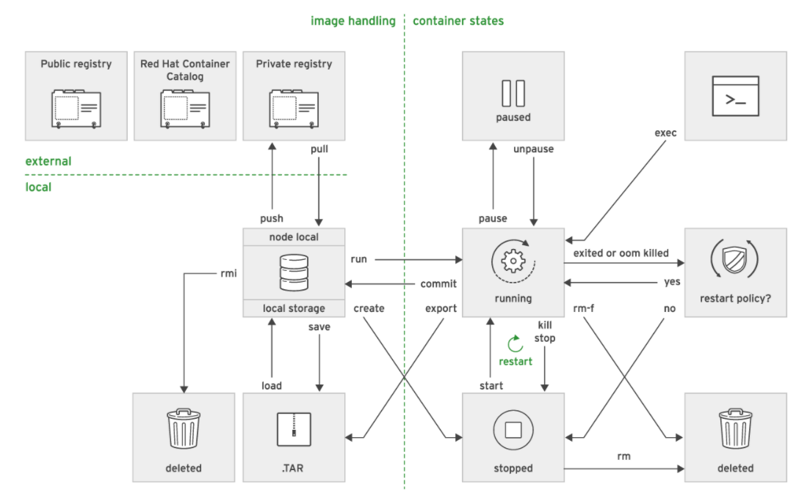
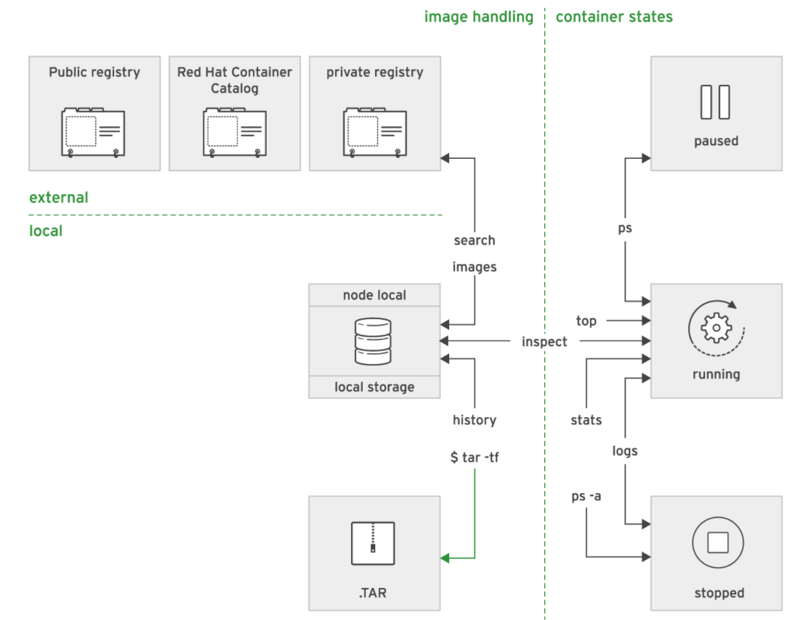

# Learn Openshift

#### # Deploy app from GitHub
```bash
$ oc new-app --name version https://github.com/fahmifahim/DO101-apps#update-app --context-dir version

$ oc get all
        NAME                           READY   STATUS      RESTARTS   AGE
        pod/version-1-build            0/1     Completed   0          12m
        pod/version-6886df6f44-b6d6v   1/1     Running     0          10m

        NAME              TYPE        CLUSTER-IP      EXTERNAL-IP   PORT(S)    AGE
        service/version   ClusterIP   172.30.203.24   <none>        8080/TCP   12m

        NAME                      READY   UP-TO-DATE   AVAILABLE   AGE
        deployment.apps/version   1/1     1            1           12m

        NAME                                 DESIRED   CURRENT   READY   AGE
        replicaset.apps/version-6886df6f44   1         1         1       10m
        replicaset.apps/version-b66c8c69c    0         0         0       12m

        NAME                                     TYPE     FROM             LATEST
        buildconfig.build.openshift.io/version   Source   Git@update-app   1

        NAME                                 TYPE     FROM          STATUS     STARTED          DURATION
        build.build.openshift.io/version-1   Source   Git@6459e50   Complete   12 minutes ago   1m37s

        NAME                                     IMAGE REPOSITORY                                                                             TAGS     UPDATED
        imagestream.image.openshift.io/version   default-route-openshift-image-registry.apps.ocp-ap3.prod.nextcle.com/fahmi-version/version   latest   10 minutes ago

$ oc get svc
        NAME      TYPE        CLUSTER-IP      EXTERNAL-IP   PORT(S)    AGE
        version   ClusterIP   172.30.203.24   <none>        8080/TCP   23m

$ oc expose svc/version
        route.route.openshift.io/version exposed

$ oc get routes
        NAME      HOST/PORT                                             PATH   SERVICES   PORT       TERMINATION   WILDCARD
        version   version-fahmi-version.apps.ocp-ap3.prod.nextcle.com          version    8080-tcp                 None

```

#### # Configuring the Horizontal Pod Autoscaler
-  Some applications receive a large number of concurrent requests only during certain periods, which makes it very difficult to size the number of pods up front before running the application. However, there are extra costs associated with running more pods than required when traffic is not at its peak.

- Red Hat OpenShift Container Platform refers to the action of changing the number of pods for an application as scaling. Scaling up refers to increasing the number of pods for an application. Scaling down refers to decreasing that number. Scaling up allows the application to handle more client requests, and scaling down provides cost savings when the load goes down. 

- When scaling up an application, the OpenShift platform first deploys a new pod and then waits for the pod to be ready. Only after the new pod becomes available does the OpenShift platform configure the route to also send traffic to the new pod. 

- When scaling down, OpenShift reconfigures the route to stop sending traffic to the pod, and then deletes the pod. 

```bash
$ oc autoscale dc/frontend --min=1 --max=5 --cpu-percent=80

The options are as follows:

dc/frontend
    Name of the application deployment configuration resource 

--min=1
    Minimum number of pods 

--max=5
    Maximum number of pods. HPA does not scale up the application beyond this limit, even if the load continues to increase. 

--cpu-percent=80
    Ideal average CPU utilization for each pod. If the global average CPU utilization is above that value, then HPA starts a new pod. If the global average CPU utilization is below the value, then HPA deletes a pod. 
```


## # Creating Containerized Services
### # Provisioning Containerized Services
#### # Managing Containers with Podman
- Podman is an open source tool for managing containers and container images and interacting with image registries. Some of the following key features:
    - It uses image format specified by the Open Container Initiative (OCI). It define an standard, community-driven, non-proprietary image format.
    - It stores local images in local file-system. It avoids unnecessary client/server architecture or having daemons running on local machine.
    - It follows the same command patterns as the Docker CLI, no need to learn a new toolset.
    - Podman compatible with Kubernetes. 

#### # Fetching Container Images with Podman
```bash
$ sudo podman search rhel
		INDEX      NAME                            DESCRIPTION  STARS OFFICIAL AUTOMATED
		redhat.com registry.access.redhat.com/rhel This plat... 0
		
$ sudo podman pull rhel
		Trying to pull registry.access.redhat.com/rhel...Getting image source signatures
		Copying blob sha256: ...output omitted...
		 72.25 MB / 72.25 MB [======================================================] 8s
		Writing manifest to image destination
		Storing signatures
		699d44bc6ea2b9fb23e7899bd4023d3c83894d3be64b12e65a3fe63e2c70f0ef

$ sudo podman images
        REPOSITORY                        TAG      IMAGE ID       CREATED       SIZE
        registry.access.redhat.com/rhel   latest   699d44bc6ea2   4 days ago    214MB
```

#### # Running Containers
- Podman command options: 
    - -t or --tty, meaning a pseudo-tty (pseudo-terminal) is to be allocated for the container.
    - -i or --interactive. When used, standard input is kept open into the container.
    - -d or --detach, means the container runs in the background (detached). Podman prints the container id.

```bash
$ sudo podman run rhel:latest echo 'Hello!'
        Hello!

$ sudo podman run -d rhscl/httpd-24-rhel7:2.4-36.5
        ff4ec6d74e9b2a7b55c49f138e56f8bc46fe2a09c23093664fea7febc3dfa1b2
```

- Exercise
    1. Creating MYSQL Database instance
    ```bash
    $ sudo podman run --name mysql-basic \
            > -e MYSQL_USER=user1 -e MYSQL_PASSWORD=mypa55 \
            > -e MYSQL_DATABASE=items -e MYSQL_ROOT_PASSWORD=r00tpa55 \
            > -d rhscl/mysql-57-rhel7:5.7-3.14
            Trying to pull ...output omitted...
            Copying blob sha256:e373541...output omitted...
            69.66 MB / 69.66 MB [===================================================] 8s
            Writing manifest to image destination
            Storing signatures
            92eaa6b67da0475745b2beffa7e0895391ab34ab3bf1ded99363bb09279a24a0
    ```

    - Verify containers
    ```bash
    $ sudo podman ps --format "{{.ID}} {{.Image}} {{.Names}}"
            92eaa6b67da0 registry.access.redhat.com/rhscl/mysql-57-rhel7:5.7-3.14 mysql-basic
    ```

    - Access the container 
    ```bash
    $ sudo podman exec -it mysql-basic /bin/bash
            bash-4.2$
    ```

    - Access the mysql database and put some entries
    ```bash
    bash-4.2$ mysql -uroot
            Welcome to the MySQL monitor.  Commands end with ; or \g.
            ...output omitted...
    mysql> 

    mysql> show databases;
            +--------------------+
            | Database           |
            +--------------------+
            | information_schema |
            | items              |
            | mysql              |
            | performance_schema |
            | sys                |
            +--------------------+
            5 rows in set (0.01 sec)

    mysql> use items;
            Database changed

    mysql> CREATE TABLE Projects (id int(11) NOT NULL,
        -> name varchar(255) DEFAULT NULL,
        -> code varchar(255) DEFAULT NULL,
        -> PRIMARY KEY (id));
            Query OK, 0 rows affected (0.01 sec)

    mysql> show tables;
            +---------------------+
            | Tables_in_items     |
            +---------------------+
            | Projects            |
            +---------------------+
            1 row in set (0.00 sec)

    mysql> insert into Projects (id, name, code) values (1,'DevOps','AAO180');
            Query OK, 1 row affected (0.02 sec)

    mysql> select * from Projects;
            +----+-----------+-------+
            | id | name      | code  |
            +----------------+-------+
            |  1 | DevOps    | AAO180 |
            +----------------+-------+
            1 row in set (0.00 sec)

    mysql> exit
            Bye
    bash-4.2$ exit
            exit
    ```

    2. Creating Web-Service apps
    ```bash
    # Start HTTP-Apache container 
    $ sudo podman run -d -p 8080:80 --name httpd-basic redhattraining/httpd-parent:2.4

    # Test the container
    $ curl http://localhost:8080

    # Change the display message to HOLA!!
    $ sudo podman exec -it httpd-basic /bin/bash
        bash-4.4# 
        bash-4.4# echo "HOLA!!" > /var/www/html/index.html
        bash-4.4# exit

    # Test the container
    $ curl http://localhost:8080

    ```


## # Managing Containers
### # Managing the Life Cycle of Containers
#### # Container Life Cycle Management with Podman
- Podman managed subcommands for container life cycle management
        

- Podman query subcommand
        

#### # Creating container
```bash
$ sudo podman run rhscl/httpd-24-rhel7
        Trying to pull regist...httpd-24-rhel7:latest...Getting image source signatures
        Copying blob sha256:23113...b0be82
        72.21 MB / 72.21 MB [======================================================] 7s
        ...output omitted...AH00094: Command line: 'httpd -D FOREGROUND'

$ sudo podman run --name my-httpd-container rhscl/httpd-24-rhel7
        ...output omitted...AH00094: Command line: 'httpd -D FOREGROUND'

$ sudo podman run --name my-httpd-container -d rhscl/httpd-24-rhel7
        77d4b7b8ed1fd57449163bcb0b78d205e70d2314273263ab941c0c371ad56412
```

#### # Running command inside a container
```bash
$ sudo podman exec my-httpd-container cat /etc/hostname
        7ed6e671a600

$ sudo podman exec -l cat /etc/hostname
        7ed6e671a600
```

#### # Managing Containers
- podman ps: Lists running containers
```bash
$ sudo podman ps
        CONTAINER ID   IMAGE         COMMAND      CREATED  STATUS   PORTS    NAMES
        77d4b7b8ed1f1 rhscl/httpd-24-rhel72 "httpd..."3 ...ago4 Up...5 80/tcp6 my-htt...7

# List all containers including the stopped ones
$ sudo podman ps -a
        CONTAINER ID  IMAGE        COMMAND     CREATED  STATUS        PORTS  NAMES
        4829d82fbbff  rhscl/httpd-24-rhel7  "httpd..."  ...ago   Exited (0)...        my-httpd...
```

- podman inspect: lists metadata about a running or stopped container. 
```bash
$ sudo podman inspect my-httpd-container
        [
        {
        "Id": "980e45...76c8be",
        ...output omitted...
        "NetworkSettings": {
                "Bridge": "",
                "EndpointID": "483fc9...5d801a",
                "Gateway": "172.17.42.1",
                "GlobalIPv6Address": "",
                "GlobalIPv6PrefixLen": 0,
                "HairpinMode": false,
                "IPAddress": "172.17.0.9",
        ...output omitted...

$ sudo podman inspect -f '{{ .NetworkSettings.IPAddress }}' my-httpd-container
        172.17.0.9
```

- podman stop  
        `podman stop -a`

- podman kill

- podman restart

- podman rm  
        `podman rm -a`


## # Managing Container Images
### # Accessing Registries
#### # Public Registries
- Public domain registry which is available for all developers to pull the provided container images

#### # Private Registries
- Organization privacy and secret protection
- Legal restrictions and laws
- Avoidance of publishing images in development


#### # Configuring Registries in Podman
- Registry configuration file in Podman located at `/etc/container/registries.conf`  

        ```bash
        [registries.search]
        registries = ["registry.access.redhat.com", "quay.io"]
        ```

>Use an FQDN and port number to identify a registry. 
>Default port number for a registry is 5000. If the registry uses a different port, it must be specified. Indicate port numbers by appending a colon (:) and the port number after the FQDN.

- Secure connections to a registry require a trusted certificate. 
- To enable insecure connections, add the registry name to the registries entry in [registries.insecure] section of `/etc/containers/registries.conf` :

```bash
[registries.insecure]
registries = ['localhost:5000']
```

#### # Accessing Registries
- Searching for Images in Registries  
```bash
$ sudo podman search [OPTIONS] <term>
$ sudo podman search docker.io/nginx -f is-official=true

[OPTIONS]
--limit <number> : Limits the number of listed images per registry.
--filter <filter=value>
    stars=<number> : Show only images with at least this number of stars
    is-automated=<true|false> : Show only images automatically built.
    is-official=<true|false> : Show only images flagged as official.
--tls-verify <true|false> : Enables or disables HTTPS certificate validation for all used registries. true
```

#### # Registry Authentication  
- Some container image registries require access authorization.  
```bash
$ sudo podman login -u username -p password registry.access.redhat.com
        Login Succeeded!
```

#### # Pulling Images  
```bash
$ sudo podman pull [OPTIONS] [REGISTRY[:PORT]/]NAME[:TAG]
$ sudo podman pull quay.io/bitnami/nginx
```  
>If the image name does not include a registry name, Podman searches for a matching container image using the registries listed in the `/etc/containers/registries.conf`. Podman search for images in registries in the same order they appear in the configuration file.  
>If the tag is not specified, `latest` will be the default tag information. 


### # Manipulating Container Images
- Developer can save the container image to a .tar file
- Developer can publish (push) container image to a image registry

#### # Saving and Loading Images
- Existing images from the Podman local storage can be saved to a .tar file
- The generated file is not a regular TAR archive; it contains image metadata and preserves the original image layers.  
```bash
$ sudo podman save [-o FILE_NAME] IMAGE_NAME[:TAG]
$ sudo podman save -o mysql.tar registry.access.redhat.com/rhscl/mysql-57-rhel7:5.7
```

- Load or restore container image using below command.  
```bash
$ sudo podman load [-i FILE_NAME]
$ sudo podman load -i mysql.tar
```


#### # Deleting Images
- Downloaded images are kept in local storage. However, images can be outdated and should be regularly replaced
- Images are not automatically updated. 
- Delete image from local storage by running below  
```bash
$ sudo podman rmi [OPTIONS] IMAGE [IMAGE...]
```

- Deleting all Images  
```bash
$ sudo podman rmi -a
```

#### # Modifying Images


#### # Tagging Images
```bash
$ sudo podman tag [OPTIONS] IMAGE[:TAG] [REGISTRYHOST/][USERNAME/]NAME[:TAG]
$ sudo podman tag mysql-custom devops/mysql
$ sudo podman tag mysql-custom devops/mysql:snapshot
$ sudo podman tag mysql-custom:1.1 devops/mysql:1.2
```  
>Podman assumes the latest tag version if the tag value is not mentioned

- Removing Tags from Images  
```bash
$ sudo podman rmi devops/mysql:snapshot
```

#### # Publishing Images to a Registry
```bash
$ sudo podman push [OPTIONS] IMAGE [DESTINATION]
$ sudo podman push quay.io/bitnami/nginx
```

#### # Exercise
<details><summary>Review your knowledge, now!</summary>

1. Use the podman search command to locate the docker.io/nginx official image and pull it into your local file system. Ensure that the image has been successfully retrieved.  
```bash
$ sudo podman search docker.io/nginx -f is-official=true
        INDEX      NAME                     DESCRIPTION               STARS  OFFICIAL...
        docker.io  docker.io/library/nginx  Official build of Nginx.  12022  [OK]    ...

$ sudo podman pull docker.io/nginx:1.17
        Trying to pull Trying to pull docker.io/nginx:1.17...
        ...output omitted...
        Storing signatures
        42b4762643dcc9bf492b08064b55fef64942f055f0da91289a8abf93c6d6b43c

$ sudo podman images nginx
        REPOSITORY                TAG        IMAGE ID       CREATED      SIZE
        docker.io/library/nginx   1.17   42b4762643dc   8 days ago   130MB
```

2. Start a new container using the Nginx image, according to the specifications listed in the following list.  
        - Name: official-nginx  
        - Run as daemon: yes  
        - Container image: nginx  
        - Port forward: from host port 8080 to container port 80.    
```bash
$ sudo podman run --name official-nginx -d -p 8080:80 docker.io/nginx:1.17
        12dbc348c7dcf8560604a44b11926712f018b0ac44063d34b05704fb8447316f

# Check running pod
$ sudo podman ps 
```

3. Log in to the container using the exec subcommand. Replace the contents of the index.html file with "HELLO WORLD". The web server directory is located at /usr/share/nginx/html.  
After the file has been updated, exit the container and use the curl command to access the web page.  

```bash
$ sudo podman exec -it official-nginx /bin/bash
        root@12dbc348c7dc:/ 

# Update the index.html file located at /usr/share/nginx/html. 
root@12dbc348c7dc:/ echo 'HELLO WORLD' > /usr/share/nginx/html/index.html

# Exit the container.
root@12dbc348c7dc:/ exit

# Use the curl command to ensure that the index.html file is updated.
$ curl localhost:8080
or
$ curl 127.0.0.1:8080
        HELLO WORLD

# You may also access directly to container IP
$ sudo podman inspect official-nginx | grep IPAddress
        "IPAddress": "10.88.0.3"
$ curl 10.88.0.3:80
        HELLO WORLD
```

4. Stop the running container and commit your changes to create a new container image. Give the new image a name of test/mynginx and a tag of v1.0-SNAPSHOT. Use the following specifications:

- Image name: test/mynginx  
- Image tag: v1.0-SNAPSHOT  
- Author name: your name

```bash
# Stop the official-nginx container.
$ sudo podman stop official-nginx
        2dbc348c7dcf8560604a44b11926712f018b0ac44063d34b05704fb8447316f

# Check pod status
$ sudo podman ps -a
        # Check the container status is Exited

# Commit your changes to a new container image. Use your name as the AUTHOR of the changes.
$ sudo podman commit -a 'YOUR NAME' official-nginx test/mynginx:v1.0-SNAPSHOT
        Getting image source signatures
        ...output omitted...
        Storing signatures
        4a13dd08d175a6095e6462e52431be1577ca931fcd1aea139b71346bfc7f9c76

# List the available container images to locate your newly created image.
$ sudo podman images
        REPOSITORY                      TAG           IMAGE ID      CREATED        SIZE
        localhost/test/mynginx         v1.0-SNAPSHOT 4a13dd08d175  5 minutes ago  130MB
        docker.io/nginx                 1.17          42b4762643dc  8 days ago     113MB
```

5. Start a new container using the updated Nginx image, according to the specifications listed in the following list.  
- Name: official-nginx-dev
- Run as daemon: yes
- Container image: test/mynginx:v1.0-SNAPSHOT
- Port forward: from host port 8080 to container port 80.

```bash
$ sudo podman run --name official-nginx-dev -d -p 8080:80 test/mynginx:v1.0-SNAPSHOT
$ sudo podman ps
```

6. Log in to the container using the exec subcommand to introduce a final change. Replace the contents of the file /usr/share/nginx/html/index.html file with "UNDER CONSTRUCTION".  
After the file has been updated, exit the container and use the curl command to verify the changes.

```bash
# Log in to the container
$ sudo podman exec -it official-nginx-dev /bin/bash
        root@12dbc348c7dc:/ 

# Update the index.html file located at /usr/share/nginx/html. The file should read HELLO WORLD Page.
        root@02dbc348c7dc:/ echo 'UNDER CONSTRUCTION"' > /usr/share/nginx/html/index.html

# Exit the container.
        root@02dbc348c7dc:/ exit

# Use the curl command to ensure that the index.html file is updated.
$ curl localhost:8080
or
$ curl 127.0.0.1:8080
        UNDER CONSTRUCTION

# Access directly to container
$ sudo podman inspect official-nginx-dev | grep IPAddress
$ curl [IPAddress]:80
        UNDER CONSTRUCTION
```

7. Stop the running container and commit your changes to create the final container image. Give the new image a name of test/mynginx and a tag of v1.0. Use the following specifications:  
- Image name: test/mynginx  
- Image tag: v1.0  
- Author name: your name

```bash
# Stop the official-nginx-dev container.
$ sudo podman stop official-nginx-dev
        2dbc348c7dcf8560604a44b11926712f018b0ac44063d34b05704fb8447316f

#Check pod status. Container should be Exited
$ sudo podman ps
$ sudo podman ps -a

# Commit your changes to a new container image. Use your name as the author of the changes.
$ sudo podman commit -a 'Your Name' official-nginx-dev test/mynginx:v1.0
        Getting image source signatures
        ...output omitted...
        Storing signatures
        4a13dd08d175a6095e6462e52431be1577ca931fcd1aea139b71346bfc7f9c76

# List the available container images in order to locate your newly created image.
$ sudo podman images
        REPOSITORY                     TAG            IMAGE ID      CREATED        SIZE
        localhost/test/mynginx        v1.0           892569a87e3f  7 seconds ago  130MB
        localhost/test/mynginx        v1.0-SNAPSHOT  0857d81f5a4b  4 minutes ago  130MB
        docker.io/nginx                1.17           42b4762643dc  8 days ago     130MB
```

8. Remove the stopped container and the development image test/mynginx:v1.0-SNAPSHOT from local image storage.

```bash
# Despite being stopped, the official-nginx-dev is still present. Display the container with the podman ps command with the -a flag.
$ sudo podman ps -a --format="{{.ID}} {{.Names}} {{.Status}}"
        e169c5fc8c3e   official-nginx-dev   Exited (0) 9 minutes ago
        ccf046c2f87d   official-nginx       Exited (0) 12 minutes ago

# Remove the container.
$ sudo podman rm official-nginx-dev 
        e169c5fc8c3ed5c024af94aec752fa565650f9d07b95bb009329874801d859a1o

# Verify that the container is deleted.
$ sudo podman ps -a --format="{{.ID}} {{.Names}} {{.Status}}"
        ccf046c2f87d   official-nginx       Exited (0) 12 minutes ago

# Remove the test/mynginx:v1.0-SNAPSHOT image.
$ sudo podman rmi test/mynginx:v1.0-SNAPSHOT
        Untagged: localhost/test/mynginx:v1.0-SNAPSHOT

# Verify that the image is no longer present by listing all images using the podman images command.
$ sudo podman images
        REPOSITORY                       TAG      IMAGE ID       CREATED          SIZE
        localhost/test/mynginx          v1.0     892569a87e3f   13 minutes ago   113MB
        docker.io/library/nginx          1.17     42b4762643dc   8 days ago       130MB
```

9. Use the image tagged test/mynginx:v1.0 to create a new container with the following specifications:  
- Container name: my-nginx  
- Run as daemon: yes  
- Container image: test/mynginx:v1.0  
- Port forward: from host port 8280 to container port 80  
On workstation, use the curl command to access the web server, accessible from the port 8280.

```bash
$ sudo podman run -d --name my-nginx -p 8280:80 do180/mynginx:v1.0
        c1cba44fa67bf532d6e661fc5e1918314b35a8d46424e502c151c48fb5fe6923

# Use the curl command to ensure that the index.html page is available and returns the custom content.
$ curl localhost:8280
$ curl 127.0.0.1:8280
        HELLO WORLD Page
```

</details>


## # Creating Custom Container Images
### # Designing Custom Container Images
#### # Dockerfile and S2I (Source to Image)
- A **Dockerfile** is a text document that contains all the commands a user could call on the command line to assemble an image. Using `docker build` users can create an automated build that executes several command-line instructions in succession. 

- **S2I**  
        - S2I provides alternatives to Dockerfile. S2I uses following process to build a custom container image:  
        1. Start a container from a base container image called the **builder image**, which includes a programming language runtime and essential development tools such as compilers and package managers.  
        2. **Fetch the application source code**, usually from a Git server, and send it to the container.  
        3. **Build the application binary** files inside the container.  
        4. **Save the container**, after some clean up, as a new container image, which includes the programming language runtime and the application binaries.

### # Building Custom Container Images with Dockerfiles
#### # Building Base Containers
1. Create a Working Directory  
        - it is a directory containing all files needed to build the image
        - for security reason, avoid root directory / as working directory  
2. Write **Dockerfile**  
```bash
# Comment
INSTRUCTION
```

3. Build the image with Podman  
```bash
$ podman build -t NAME:TAG DIR
```  
- DIR : path to the working directory, which must include the Dockerfile. It can be the current directory as designated by a dot (.) 
- NAME:TAG is a name with a tag given to the new image. If TAG is not specified, default is `latest`.

#### # Write Dockerfile  
Sample of Dockerfile:  

```bash
# This is a comment line        -->1
FROM ubi7/ubi:7.7               -->2
LABEL description="This is a custom httpd container image" -->3
MAINTAINER Tim Robert <trobert@xyz.com>         -->4
RUN yum install -y httpd                        -->5
EXPOSE 80                                       -->6
ENV LogLevel "info"                             -->7
ADD http://someserver.com/filename.pdf /var/www/html -->8
COPY ./src/ /var/www/html/                      -->9
USER apache                                     -->10
ENTRYPOINT ["/usr/sbin/httpd"]  -->11
CMD ["-D", "FOREGROUND"]        -->12
```  

1 : Lines that begin with # are comments.  
2 : The FROM instruction declares that the new container image extends ubi7/ubi:7.7 container base image.  
3 : The LABEL is responsible for adding generic metadata to an image. A LABEL is a simple key-value pair.  
4 : MAINTAINER indicates the Author field of the generated container image's metadata.  
5 : RUN executes commands in a new layer on top of the current image. The shell to execute commands is `/bin/sh`.  
6 : EXPOSE indicates that the container listens on the specified network port at runtime. The EXPOSE instruction defines metadata only; it does not make ports accessible from the host. The -p option in the podman run command exposes container ports from the host.  
7 : ENV is responsible for defining environment variables that are available in the container.  
8 : ADD instruction copies files or folders from a local or remote source and adds them to the container's file system. If used to copy local files, those must be in the working directory. ADD instruction unpacks local .tar files to the destination image directory.  
9 : COPY copies files from the working directory and adds them to the container's file system. It is not possible to copy a remote file using its URL with this Dockerfile instruction.  
10 : USER specifies the username or the UID to use when running the container image for the RUN, CMD, and ENTRYPOINT instructions.  
11 : ENTRYPOINT specifies the default command to execute when the image runs in a container. If omitted, the default ENTRYPOINT is /bin/sh -c.  
12 : CMD provides the default arguments for the ENTRYPOINT instruction.

#### # Layering Image
- Each instruction in a Dockerfile creates a new image layer. Having too many instructions in a Dockerfile causes too many layers, resulting in large images.  
- Sample of heavy layers Dockerfile:  
```bash
RUN yum --disablerepo=* --enablerepo="rhel-7-server-rpms"
RUN yum update -y
RUN yum install -y httpd
```  
- Simplyfied into one instruction
```bash
RUN yum --disablerepo=* --enablerepo="rhel-7-server-rpms" && yum update -y && yum install -y httpd
```  
- Make it better readability
```bash
RUN yum --disablerepo=* --enablerepo="rhel-7-server-rpms" && \
    yum update -y && \
    yum install -y httpd
```

#### # Exercise
<details><summary>Review your knowledge, now!</summary>

1. Create a new Dockerfile with below specs:  
- Use UBI 7.7 as a base image by adding the following FROM instruction at the top of the new Dockerfile  
- Include the MAINTAINER instruction to set the Author field in the new image. Replace the values to include your name and email address  
- Add the following LABEL instruction to add description metadata to the new image  
- Add a RUN instruction with a yum install command to install Apache on the new container  
- Add a RUN instruction to replace contents of the default HTTPD home page  
- EXPOSE port 80, so that the container will listen on this port  
>>NOTE  
>>The EXPOSE instruction does not actually make the specified port available to the host; rather, the instruction serves as metadata about which ports the container is listening on.  
- Use ENTRYPOINT instruction to set httpd as the default entry point:

```bash
# Create new folder with docker file
mkdir /test/mydocker
vi /test/mydocker/Dockerfile

# Create your dockerfile
FROM ubi7/ubi:7.7
MAINTAINER Tim Robert <trobert@tmail.com>
LABEL description="This is a custom image for Ubi"
RUN yum install -y httpd && ¥
    yum clean all
RUN echo "Hello! This is a cumtomized docker" > /usr/share/httpd/noindex/index.html
EXPOSE 80
ENTRYPOINT ["httpd", "-D", "FOREGROUND"]
```

2. Build and verify the Apache container image.  
- Use the following commands to create a basic Apache container image using the newly created Dockerfile:

```bash
$ sudo podman build --layers=false -t test/apache /test/mydocker/

        STEP 1: FROM ubi7/ubi:7.7
        Getting image source signatures 1
        Copying blob sha256:...output omitted...
        71.46 MB / 71.46 MB [=====================================================] 18s
        ...output omitted...
        Storing signatures
        STEP 2: MAINTAINER Tim Robert <trobert@tmail.com>
        STEP 3: LABEL description="This is a custom image for Ubi"
        STEP 4: RUN yum install -y httpd &&     yum clean all
        Loaded plugins: ovl, product-id, search-disabled-repos, subscription-manager
        ...output omitted...
        Complete!
        STEP 5: RUN echo "Hello! This is a cumtomized docker" > /usr/share/httpd/noindex/index.html
        STEP 6: EXPOSE 80
        STEP 7: ENTRYPOINT ["httpd", "-D", "FOREGROUND"]
        ERRO[0109] HOSTNAME is not supported for OCI image format...output omitted...2
        STEP 8: COMMIT ...output omitted... localhost/do180/apache:latest
        Getting image source signatures
        ...output omitted...
        Storing signatures
        --> 190a...95c5

$ sudo podman images
        REPOSITORY                          TAG     IMAGE ID      CREATED        SIZE
        localhost/test/apache              latest  c69affe9d93b  33 seconds ago 247MB
        registry.access.redhat.com/ubi7/ubi latest  6fecccc91c83  4 weeks ago    215MB
```

>>NOTE
>>Podman creates many anonymous intermediate images during the build process. They are not be listed unless -a is used. Use the **--layers=false** option of build subcommand to instruct Podman to delete intermediate images.

3. Run the Apache Container

```bash
$ sudo podman run --name test-apache -d -p 10080:80 
$ sudo podman ps
$ curl localhost:10080
        Hello! This is a cumtomized docker
```

</details>

#### # Lab Exercise
<details><summary>Review your knowledge, now!</summary>

1. Create a new Dockerfile with below specs:  
- The base image is ubi7/ubi:7.7  
- Sets the desired author name and email in the MAINTAINER part  
- Sets the environment variable PORT as 8080  
- Install Apache (httpd)  
- Change Apache configuration file /etc/httpd/conf/httpd.conf to listen port 8080 instead of default 80  
- Change ownership /etc/httpd/logs and /run/httpd to user and group apache  
- Expose the value set in the PORT environment variable
- Copy the contents of the src/ folder to the Apache Document Root (/var/www/html) inside the container  
- Start the Apache httpd daemon in the foreground using:  
```bash
httpd -D FOREGROUND
```

```bash
# Create new folder with docker file
mkdir /test/myapache
vi /test/myapache/Dockerfile

# Create your dockerfile
FROM ubi7/ubi:7.7
MAINTAINER TestUser <testuser@mail.com>
ENV PORT 8080
RUN yum install -y httpd && ¥
    yum clean all
RUN sed -ri -e "/^Listen 80/c\Listen ${PORT}" /etc/httpd/conf/httpd.conf && \
    chown -R apache:apache /etc/httpd/logs
    chown -R apache.apache /run/httpd
USER apache
EXPOSE ${PORT}
COPY ./src/ /var/www/html
ENTRYPOINT ["httpd", "-D", "FOREGROUND"]
```

2. Build the custom Apache image with the name test/custom-apache

```bash
$ sudo podman build -t test/custom-apache /test/myapache/

$ sudo podman images
```

3. Run the Apache Container  
- Name: app-container  
- Container image: test/custom-apache  
- Port forward: from host port 20080 to container port 8080  
- Run as daemon: yes

```bash
$ sudo podman run --name app-container -d -p 20080:8080 test/custom-apache
$ sudo podman ps
$ curl localhost:20080
```

</details>
